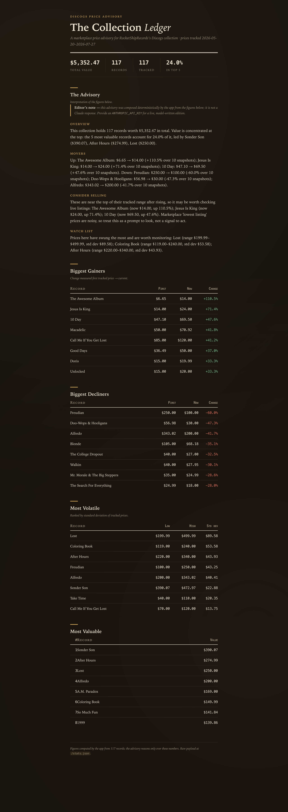

# Discogs Collection Advisor

An LLM-powered advisor for a Discogs record collection. It pulls your collection
and its marketplace price history, **computes every statistic in code**, and then
asks Claude to **reason over those verified numbers** and produce a plain-English
advisory: what your collection is worth, what's moving, what might be worth
selling, and what to watch.

Most "AI + data" demos let the model see raw data and do the math, which is
exactly where language models hallucinate. I wanted to build a system where the LLM
is genuinely useful but is **structurally prevented from touching the numbers**.




## The core design: code computes, the LLM reasons, the app renders

The whole app is one boundary drawn deliberately:

```
Discogs API ──► SQLite price history
                     │
                     ▼
        stats.py  ── computes EVERY number (SQL window functions + Python)
                     │   → a rounded, verified JSON payload of facts
                     ▼
        advisor.py ── sends ONLY that payload to Claude
                     │   the model does no arithmetic and never sees raw rows
                     ▼        it returns structured JSON (4 prose sections)
        app.py    ── owns ALL rendering; the model never emits HTML
```

Three properties are enforced, not just intended:

1. **Code computes the numbers.** `stats.py` is the only place arithmetic
   happens. Totals, price changes, percentages, value concentration, and
   per-record volatility (a population standard deviation derived from SQL
   window aggregates) are all computed deterministically and rounded *before*
   the model is involved.
2. **The LLM only reasons over verified facts.** `advisor.py` receives the
   pre-computed payload and nothing else — it never opens the database, never
   sees a raw snapshot row, and is prompted that *every number it cites must
   come from the input*. If the data is thin, it's told to say so rather than
   guess.
3. **The app owns rendering.** The model returns structured JSON with four
   fields; `app.py` and one Jinja template turn that into HTML. The model never
   controls markup or layout.

Because of this split, the figures on the page are trustworthy by construction:
you can open `/stats.json` and see the exact, complete set of facts the model was
given. The model's job is to interpret them, not to produce them.

## What it computes (deterministically)

**Per record:** current lowest price, change over the tracked window ($ and %),
volatility (population std dev + high/low spread), and snapshot count.

**Collection-level:** total current value, value concentration (what % of value
sits in the top N records, via a `RANK()` + running-`SUM()` window query),
biggest gainers and losers, and the most volatile holdings.

The heavy lifting is real analytical SQL — window functions to collapse each
record's snapshot history into one summary row, and a ranked running-total query
for concentration — not Python loops over rows.

## Tech stack

- **Python / Flask** + **SQLite** (consistent with my other Discogs project)
- **requests-oauthlib** — Discogs OAuth1
- **anthropic** — the reasoning layer (Claude)
- Server-rendered Jinja template, no build step

## Setup

```bash
git clone <your-repo-url>
cd DiscogsAdvisor
python -m venv .venv && source .venv/bin/activate
pip install -r requirements.txt

cp .env.example .env        # fill in Discogs creds, ANTHROPIC_API_KEY, DISCOGS_USERNAME
python sync.py              # pull the collection + take price snapshots
python app.py               # report at http://localhost:5002
```

Snapshots accumulate over time — run `sync.py` on a schedule (or point
`DISCOGS_DB_PATH` at an existing [discogs-tracker](https://github.com/jackpwill/discogs-tracker)
database, which shares this schema) to give the change/volatility stats a real
window to work with. With a single snapshot the app still runs; per-window
metrics simply report as unavailable rather than being fabricated.

### Try it in 30 seconds — no Discogs or Anthropic account needed

```bash
python sample_data.py                              # seed a realistic sample collection
DISCOGS_USERNAME=sample_collector ADVISOR_DEMO=1 python app.py
```

This renders the complete report — including all four advisory sections — from
bundled sample data with several weeks of synthetic price history.

**A note on the advisory in this mode:** `ANTHROPIC_API_KEY` unlocks a live,
Claude-written advisory. A Claude *Pro* subscription does **not** include API
access — the API is a separate, prepaid product ([console.anthropic.com](https://console.anthropic.com/));
a full advisory call here costs roughly two cents. When no key is present (or
`ADVISOR_DEMO=1`), the app instead renders a **deterministic offline advisory**:
the same four sections generated by a plain template over the computed numbers,
labeled in the UI as a sample and explicitly *not* a model response. It exists so
the app is fully runnable and demoable for free — and it reuses the verified
figures rather than inventing any, exactly like the real thing.

### Environment variables

See `.env.example`. `ANTHROPIC_API_KEY` and the four Discogs OAuth values are
required; `DISCOGS_USERNAME` selects the collection; `ANTHROPIC_MODEL` and
`DISCOGS_DB_PATH` are optional overrides.

## Tests

```bash
python -m unittest discover tests
```

The suite (no network or API key needed) pins the two guarantees the project is
built on: that the statistics are computed correctly — including that price
change is *first-vs-current*, not a min/max artifact, and that single-snapshot
records get no fabricated metrics — and that the LLM layer never imports the
database or receives raw rows.

## Notes

- No secret is committed: everything sensitive lives in a gitignored `.env`, and
  `.env.example` contains variable names only.
- The advisory is informational, not financial advice — marketplace "lowest
  listing" prices are noisy and the model is prompted to be explicit about that
  uncertainty.

## License

MIT — see [LICENSE](LICENSE).
